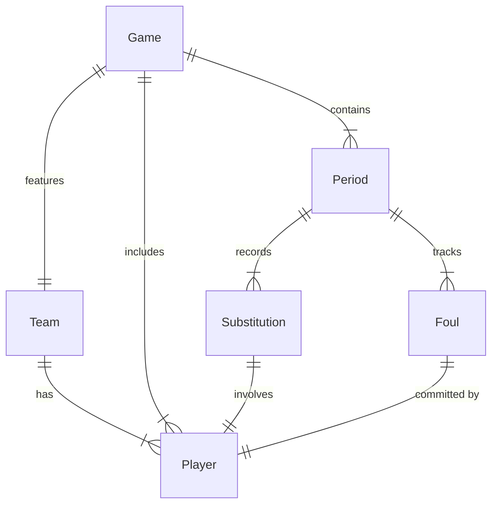

# Basketball Subs Data Model

This document describes the data model used in the Basketball Subs application. The application is designed to manage basketball teams, games, and track substitutions and fouls during games.

## Core Models

### Player
A player represents a basketball team member.

| Field  | Type   | Description |
|--------|--------|-------------|
| id     | string | Unique identifier for the player |
| name   | string | Player's full name |
| number | string | Player's jersey number |

### Team
A team represents a basketball team with its roster of players.

| Field   | Type     | Description |
|---------|----------|-------------|
| id      | string   | Unique identifier for the team |
| name    | string   | Team name |
| players | Player[] | Array of players on the team's roster |

### Game
A game represents a basketball match between two teams.

| Field           | Type     | Description |
|-----------------|----------|-------------|
| id             | string   | Unique identifier for the game |
| date           | Date     | Date when the game is played |
| team           | Team     | The primary team playing the game |
| opponent       | string   | Name of the opposing team |
| players        | Player[] | Array of players available for this game (includes regular team players and fill-in players) |
| periods        | Period[] | Array of periods in the game |
| activePlayers  | string[] | Array of player IDs currently on the court |
| currentPeriod  | number   | Index of the current period (0-based) |
| isRunning      | boolean  | Whether the game clock is currently running |
| periodStartTime | number? | Timestamp when the current period was started (optional) |
| periodTimeElapsed | number? | Seconds elapsed when the period was last paused (optional) |

### Period
A period represents a quarter or half in the game.

| Field         | Type           | Description |
|---------------|----------------|-------------|
| id            | string        | Unique identifier for the period |
| periodNumber  | number        | Sequential number of the period (1-based) |
| length        | 10 \| 20     | Length of the period in minutes (either 10 or 20) |
| substitutions | Substitution[] | Array of substitutions made during this period |
| fouls         | Foul[]       | Array of fouls committed during this period |
| subEvents | SubstitutionEvent[] | Array of substitution events in this period |

### Substitution
A substitution represents a player entering or leaving the game.

| Field         | Type    | Description |
|---------------|---------|-------------|
| id            | string  | Unique identifier for the substitution |
| player        | Player  | The player being substituted |
| timeIn        | number  | Seconds remaining in the period when player entered |
| timeOut       | number? | Seconds remaining in the period when player exited (null if still in game) |
| secondsPlayed | number? | Total seconds played in this substitution (null if still in game) |
| periodId      | string  | ID of the period this substitution belongs to |
| timeInEvent | string | ID of the SubstitutionEvent when subbed in |
| timeOutEvent | string? | ID of the SubstitutionEvent when subbed out |

### SubstitutionEvent
A SubstitutionEvent represents a single substitution action, which may involve multiple players being subbed in and out at a specific time.

| Field   | Type     | Description |
|---------|----------|-------------|
| id      | string   | Unique identifier for the substitution event |
| eventTime | number | Seconds remaining in the period when the event occurred |
| periodId | string  | The period this event belongs to |
| subbedIn | Player[] | Array of players subbed onto the court |
| playersOut | Player[] | Array of players subbed off the court |

#### Editing Substitution Events
Substitution events can be edited. When an event is edited, the application:
- Updates the event's time, subbed in, and subbed out players.
- Adds or removes substitution records as needed to match the new event.
- Updates the end time and played time for players subbed out.
- Ensures the game's active player list is recalculated to reflect the new on-court state after the edit.
### Foul
A foul represents a personal foul committed by a player.

| Field         | Type   | Description |
|---------------|--------|-------------|
| id            | string | Unique identifier for the foul |
| player        | Player | The player who committed the foul |
| periodId      | string | ID of the period when the foul occurred |
| timeRemaining | number | Seconds remaining in the period when the foul occurred |

## Entity Relationships

## Key Features

1. **Team Management**
   - Teams can have multiple players
   - Players have unique numbers within a team
   - Teams can be shared and imported

2. **Game Management**
   - Games can be configured for 2 halves (20 minutes each) or 4 quarters (10 minutes each)
   - Games track the active players on the court
   - Support for fill-in players who aren't on the regular team roster

3. **Period Management**
   - Each period tracks its substitutions and fouls
   - Time tracking for player participation
   - Maximum of 5 players allowed on court at any time

4. **Statistics Tracking**
   - Player minutes played
   - Fouls per player
   - Substitution history
   - Period-by-period statistics
